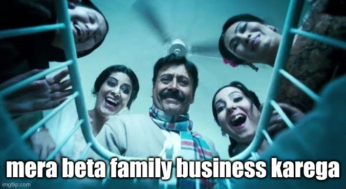
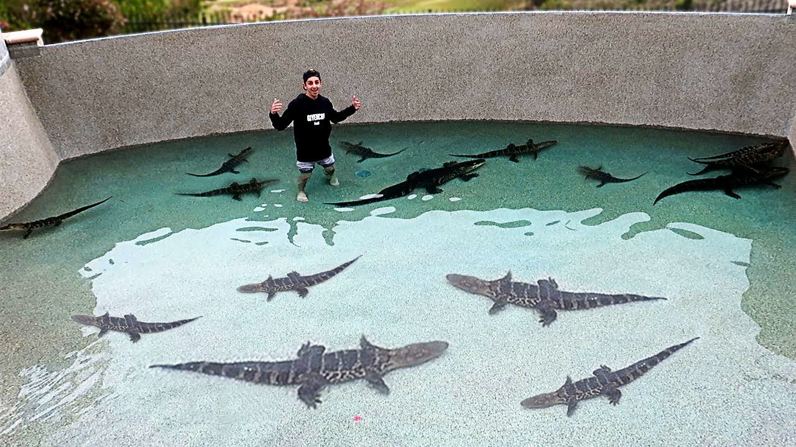

## Outline
I. [What is your career goal? Why?](/blogs/job-application-as-a-blog#i-what-is-your-career-goal-why)  
II. [Why do you want to join Frappe?](/blogs/job-application-as-a-blog#ii-why-do-you-want-to-join-frappe)  
III. [Have you demonstrated excellence in your life so far? Tell us about it.](/blogs/job-application-as-a-blog#iii-have-you-demonstrated-excellence-in-your-life-so-far-tell-us-about-it)

___
## I. What is your career goal? Why?

I was born in a family, which runs a textile manufacturing business. Before I could take my first breath of relief after [crowning](https://www.healthline.com/health/pregnancy/baby-crowning) -- my dad decided that I will join our family business.

Since my childhood, I have seen my father start his day by calling our factory manager, sharing order updates, getting production status, delivery schedules and what not!

The calls were a never-ending cycle -- receiving customer calls for sales orders, calls to team members to know the inventory & to start production (make-to-order), calls to supplier for ordering raw material, et cetera...

> **Being a kid, I could not see myself doing this, as it felt very taxing.**

This sat with me, and as I grew older I realised a common pattern in those conversations:
- ***lack of relevant information being available across the company***, as all the information sat in my dad's [persistent memory](https://www.sciencedirect.com/topics/computer-science/persistent-memory) which was isolated (wish it had API's).

- ***same set of questions being asked frequently:***
    - is the goods dispatched?
    - what's the production status of this order?
    - why is the production output so low?

**We were stuck in information relay, manual day-to-day operations and not being able to scale.**

## Turning point?

Leaning back to July 2022, I joined our family business, and saw that we used "Tally". The implementation was duct-taped, everything was done manually, and unfortunately it only took care of the compliances (not business management).

> **We had to think beyond compliance**, but our software held us back. 

Soon I figured out we needed an ERP System, but we had no documented processes & requirements, so I spent time in building knowledge base, also visualised [AS-IS](https://www.agilitysystem.net/insight/as-is-to-be-process-mapping/) business process flows -- just so we could be ERP-ready.

**Why we needed an ERP?**
* to facilitate movement of information in a structured & role-based access environment
* workflows which would facilitate & execute multi-level process & keep everyone in sync
* visibility over the inventory, production & prediction of delivery timelines
* a system which was accessible from anywhere & on any device

### **Okay...but which ERP?**

> ERP is a crowded space, and I was in the middle of the crowd -- finding the right one -- but all looked the same.

I found around 15 leads of ERP Softwares, shortlisted 4, got on a demo call with them, but none of them felt right because of: 

* complicated UI/UX -- confusing for users across the org.
* limited customisability to mimic current business-processes.
* bloated with features, while not delivering real business value.
* proprietary code, no control on what's happening behind the scenes.

## Not finding what you're looking for? 

> Maybe you're finding in the wrong place...

**There was this one company**, which wasn't part of the crowd & I discovered it much later (thanks to google search for showing sponsored Ad first) as this peculiar company didn't run ads.

**There were a lot of peculiar things I noticed with this company:**
* 100% Free & Open source ERP (no license fees)
* UX that brings peace to your brain
* UI that pleases the eye

**Since these traits were very un-common in ERP Systems, it caught my attention** -- just like this crocodile walking alone, which would catch anyone's attention.

**That company is [Frappe](https://www.frappe.io/story) & the product is called [ERPNext](https://frappe.io/erpnext).**

I tried to understand the product, where my high school accounting classes & undergrad computer science principles helped me quickly pick up on the product.

Back then Frappe used to conduct weekly demo sessions, I registered for it, but before even getting on the demo call, I knew -- if ever we are going to implement an ERP it has to be ERPNext. 

**What stood out when I saw ERPNext:**
* The UI, the forms, the lists, the reports are all very user intuitive
* Integration-first approach, allows you to connect any software or tool
* Built for customisation in-mind, so the software works your way!
* Localisation compliance & reporting -- all inside ERPNext!

**Now having such a great product at literally zero license fees, opens a wide horizon for SME's like us to scale with the help of ERPNext.**

> Frappe has eliminated the biggest blocker for SME's -- the cost.

## My career goal?

**I am near to completion** of my Bachelors in Computer Science degree, and during this whole journey as you saw -- I was more occupied towards our family business (while also being close to tech, as it gave me the power to build). 

And in this journey I realised I have spend most of my life solving problems -- as & when they are throwed at me, and majority of problems required a lot of **communication** with:

* **decision makers** -- in this case; my dad & trust me its even more difficult to convince your own dad, than a C-Suite executive
* **team members** -- understanding their pain points, recommending solutions & transitioning them towards change
* **tax consultants & auditors** -- gathering insights & working on modelling our COA & transactions to make audit process a breeze 

**I believe I was able to do it well while reconciling everyone's interest.**

There's another trait of me which I love having is -- peaking & getting to know the ERP/POS/Billing Software people use & as far as I can remember I have had this since childhood, it made me feel good to see how people interacted with different kind of softwares.

**On my visit to Vrindavan in Sep 2025**, my instinct couldn't wait -- and as always, I peaked in -- guess what? They were using ERPNext, that was [Annakoot](https://share.google/R8lDCGZR24vEbfoYC) a part of [Vrindavan Chandrodaya Mandir](https://vcm.org.in/), although the name has "mandir", its a mini city inside Vrindavan with almost everything from permanent residential accommodation, to on-demand stays, to restaurants & banquets, to shopping areas, and obviously a temple filled with serenity.

There I had the opportunity to speak with __Mr. Ajeet Ghorpade__ (Head of Operations), the [project champion](https://docs.frappe.io/erpnext/user/manual/en/the-champion) responsible for this implementation. I asked about his experience with ERPNext and I could see his face <u>lit up with happiness</u>, he was very happy that almost everything was <u>automated in ERPNext</u> & he just loved it, **whole organisation was running on ERPNext**. 

I also asked about the previous system they had before & he expressed it was so cumbersome, manual & not at all user-friendly, he was very proud that they shifted to ERPNext. Also I cared to know about they discovered ERPNext, he told one of his friend from Jaipur introduced it to him (referrals in software has the highest conversion rates). **We had a good chat & exchanged contact.**

**I loved Frappe Framework & ERPNext so much that** -- in October itself, I got involved in building an MVP of a Studio marketplace for musicians looking for spaces with specialized music instruments, which is built for & under the guidance of my cousin-brother who himself is a music artist. 

Soon after that pretty recently, I got engaged in helping a friend who runs a US-facing content agency to help build a **single source of truth** for his agency while integrating their external tools within ERPNext which can be used to manage projects, maintain communication & updates, right from the same system. 

And after doing all of this, I have realised my [riyaz](https://www.youtube.com/watch?v=UYvU-IQgB9c&t=3071s) is in **connecting with people, understanding their problems & solve for the common goal** -- along with a stint of both -- functional understanding of business & technical approach of how a problem can be solved.

> Basically, this is what I can see myself doing for the rest of my life, as this work -- doesn't feels like work & it keeps me going. 

## II. Why do you want to join Frappe?

Just after my 12th standard, I received a link from a friend to be a volunteer for a non-profit organisation, this is what their **about page said**: empowers young people to develop leadership and make positive social impacts through cross-cultural internships, volunteering, and leadership experiences. **Since I wanted to hone my leadership skills**, I applied, gave an interview & got in. 

In the interview, I tried to gather what I would be working at & what was the job profile (as the apply page didn't had any other context), I was told it would be conveyed to us after the company's off-site. After each intake-cycle, volunteers are taken for an off-site to get to know the team members better. 

At the offsite based on the observations of our superiors -- **I was told that my role was in Sales** & I got a slight taste of what the organisation was about. After we came back we had our **first induction**, and things were pretty clear -- we had to sell "tour packages of abroad" to youth which was packaged as "leadership, learning & volunteering" opportunity at partner institutions, lol.

***At the same day, I left...***

> *Because*, I will never sell anything that I would never be a customer of.

### Discovering frappe

Now, when I got introduced to Frappe & ERPNext. I felt totally opposite of what I felt in the earlier internship -- like I should **climb the mount everest & speak out loud** about the amazing products made at Frappe, so the world gets to know the goldmine it is been sitting on.

Every Frappe product resonated with the **kind of experience** I would like to have while interacting with any piece of software & Frappe did it very well, with its **design philosophy & engineering precision**. 

Soon after getting to know enough [(1)](https://www.youtube.com/watch?v=UYvU-IQgB9c) [(2)](https://www.youtube.com/watch?v=toUnvoCoSvs&) [(3)](https://www.youtube.com/watch?v=azH5g6XNbjc) about the company from the founder himself & after attending Frappeverse 2025, I really liked the whole environment of Frappe as a company (home?). 

And me being in our family business, would not be the best productive use of the talent, when I can be at a place where I can help 100's of company like ours.

**Just like how frappe embodies the importance of values in their culture, I have a similar approach to the value system I am embodied with.**

* **Whatever work I do**, I make sure that it is done best & in the best way possible -- I tend to have a tendency of questioning how things are? whether we can make changes to make it better? does making it better improves productivity? and re-iterate until its the best for all.

* **Owning my work**, everything I do -- I take the responsibility for that, even when the result goes downhill; it helps me reflect on why something happened & take home the learning for future. 

* **Being autonomous**, there has been very rare chances that someone has to tell me "do this", rather I prefer outcome-based approach -- where I have the freedom to think & execute the process, while delivering the desired outcome as expected.

**Some other reasons to work for Frappe:**

* Being around the people who shares similar value system, are performant, are one of the bests.
* For the excellence they put into the products they create.
* Play bombsquad?

**Frappe has induced so much power in my hands**, by the virtue of their products & ecosystem, I went from not-knowing what to do with my life -- to knowing exactly what I wanted to do. 

> This deserves -- me giving back to them, by becoming one of their own.

## III. Have you demonstrated excellence in your life so far? Tell us about it.

> **Whenever I see inefficiencies around me**, I can't help it but -- go all in and make sure it comes out great; better than before. 

Same thing happened when I joined our business I saw that we had a really bad implementation, it was pure chaos with everything being done manually from Account Payables to Tax Returns, we didn't even had a knowledge repository for all the financial processes. **I made it my personal goal to make it better.**

I deep dived into it, analysed 2-3 years of past transactional data -- got an idea of all kind of transactions entered, understood the structure of Chart of Accounts & analysed when statutory deductions are to be applied.

All these took some time & finally I was able to re-implement Tally by incorporating **Nature of Transaction** based classification with the help of **Voucher Types** functionality in Tally. 

Think of it as **DocType** where for each DocType (Nature of Transaction), the relevant TDS/TCS Section was pre-set along with the General Ledgers applicable to that specific transaction type & a unique Voucher ID generated for every transaction.

| **Impact** | **Before** | **After** |
|------------|------------|-----------|
| **TDS Deduction** | ❌ Manually on each transaction | ✅ Auto-applied & deducted during Voucher Entry |
| **TDS Reports (Monthly/Quarterly)** | ❌ Manually via excel | ✅ Auto-generated one-click report |
| **Interaction with Ledgers** | ❌ Remember Ledger names for entry | ✅ Auto-populated ledgers based on nature |
| **Physical Doc Filing System** | ❌ Retrieving physical records was nightmare  | ✅ Auto-DocID based 2-sec doc retrieval
| **Cognitive Load** | ❌ Meddle with 700+ Ledgers during entry | ✅ Select only 1 nature from drop-down |

**Some other initiatives taken by me:**

* Built very 1st version of documentation/knowledge repository for accounting operations.
* Built process-flows to visualise how operations executed at different business functions.

**Although the "accounting" part was sorted**, the inventory operations -- movement of goods, manufacturing, production, wastage, job work (sub-contracting) was haphazard in Tally, we couldn't achieve the level of automation we expected across our whole organisation because at its core it an accounting software.

So naturally we are going to implement ERPNext for our business.

> All these efforts were a result of striving for excellence, and I believe that when a person strives for excellence in what they do, everything around them follows.

## Ending note...

From what I have experienced so far, almost all of the business-system problems I have seen in my life can be solved by building on top of Frappe products. So, in my quest to demonstrate excellence and be able to deliver it;

**Here is my proof of work around Frappe:**

* completed [Frappe Framework](https://school.frappe.io/lms/courses/frappe-developer-certification) course on [School](https://school.frappe.io/)
* built a project [turn-knob](https://github.com/turnknob/turn_knob) using FF
* learnt about ERPNext & its modules 
* officially became a [Certified ERPNext Associate](https://school.frappe.io/api/method/frappe.utils.print_format.download_pdf?doctype=LMS+Certificate&name=2369ujbkc4&format=ERPNext%20Associate%20Certificate)
* attended Frappeverse 2025 @ Mumbai